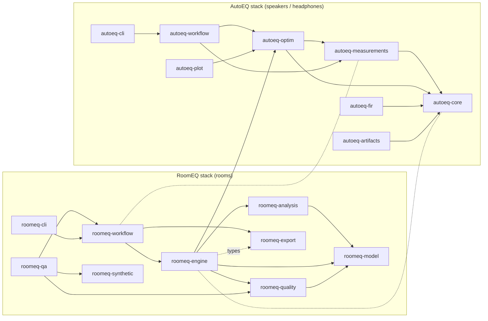
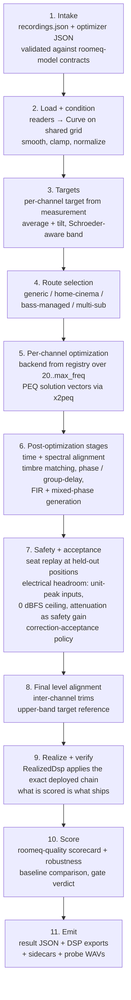
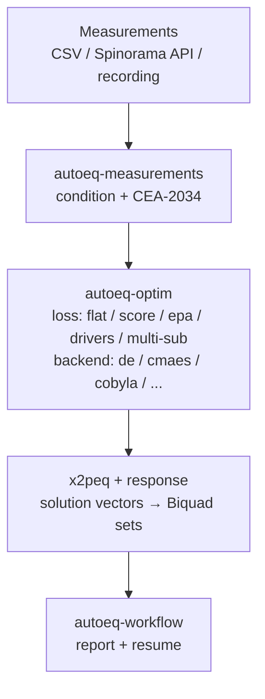
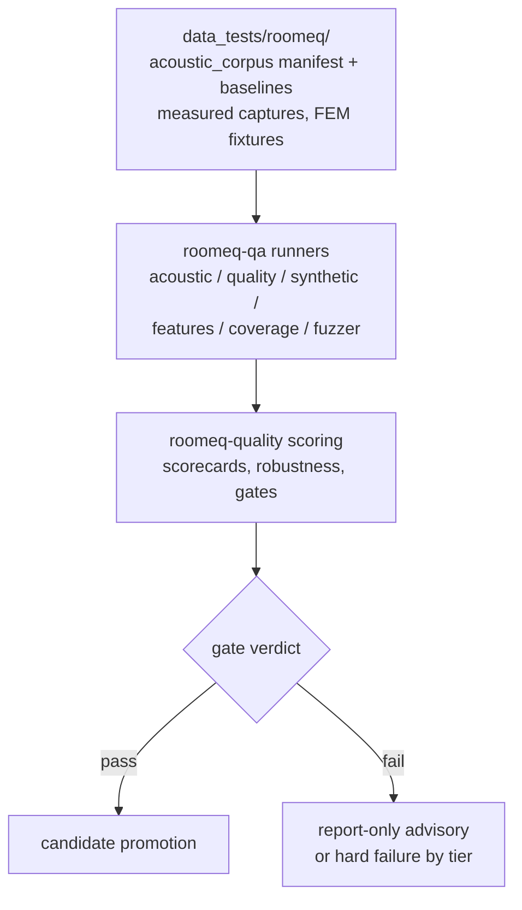

# Software Architecture

High-level view of the `autoeq` workspace: automatic equalization for
speakers, headphones, and rooms. Per-crate details live in each crate's
`ARCHITECTURE.md` (linked below). The root package (facade + binaries) is
described in §5.

Design rules that hold everywhere:

- `autoeq_iir::Biquad` is the core filter type.
- Filters stay inside trustworthy measurement-data frequency bounds, and no
  finer than the measurement/smoothing resolution warrants.
- Mismatched response grids are aligned or resampled explicitly, never zipped
  by index.
- Relative-to-peak thresholds drive passband detection.
- Minimum-phase/magnitude correction is kept separate from excess-phase,
  time-domain, and spatial-control claims.
- Exported DSP must round-trip: convolution, CamillaDSP, report, and sidecar
  contracts are conformance-tested.

## 1. Crate map

Legend: solid arrows point from a crate to what it depends on (opposite to
runtime data flow); dotted lines are shared-type relations without a
dependency. `roomeq-export` is last because it only serializes already
finalized DSP chains — runtime data flow is §2, where export is step 11.

| Crate | Role | Doc |
|---|---|---|
| `autoeq-core` | Domain + DSP primitives (`Curve`, `Biquad`, `PeqLayout`, `x2peq`) | [link](../crates/autoeq-core/ARCHITECTURE.md) |
| `autoeq-measurements` | Loaders, conditioning, CEA-2034, provenance | [link](../crates/autoeq-measurements/ARCHITECTURE.md) |
| `autoeq-optim` | Losses + optimizer backends + registry | [link](../crates/autoeq-optim/ARCHITECTURE.md) |
| `autoeq-workflow` | Speaker/headphone end-to-end runs | [link](../crates/autoeq-workflow/ARCHITECTURE.md) |
| `autoeq-cli` | `autoeq` CLI adapters | [link](../crates/autoeq-cli/ARCHITECTURE.md) |
| `autoeq-fir` | FIR design on curves | [link](../crates/autoeq-fir/ARCHITECTURE.md) |
| `autoeq-plot` | Plotly reports, static export | [link](../crates/autoeq-plot/ARCHITECTURE.md) |
| `autoeq-artifacts` | `ArtifactStore` + sidecar naming | [link](../crates/autoeq-artifacts/ARCHITECTURE.md) |
| `roomeq-model` | Config + DSP-chain contracts | [link](../crates/roomeq-model/ARCHITECTURE.md) |
| `roomeq-analysis` | Measurement-analysis primitives | [link](../crates/roomeq-analysis/ARCHITECTURE.md) |
| `roomeq-engine` | In-memory execution, DSP kernels, pipeline order | [link](../crates/roomeq-engine/ARCHITECTURE.md) |
| `roomeq-workflow` | `optimize_room`, topology routing, finalization | [link](../crates/roomeq-workflow/ARCHITECTURE.md) |
| `roomeq-export` | CamillaDSP/APO/EasyEffects/… exporters | [link](../crates/roomeq-export/ARCHITECTURE.md) |
| `roomeq-quality` | Independent scoring, corpus, gates | [link](../crates/roomeq-quality/ARCHITECTURE.md) |
| `roomeq-qa` | Regression matrices + runners | [link](../crates/roomeq-qa/ARCHITECTURE.md) |
| `roomeq-synthetic` | Deterministic ground-truth curves | [link](../crates/roomeq-synthetic/ARCHITECTURE.md) |
| `roomeq-cli` | `roomeq` CLI surface | [link](../crates/roomeq-cli/ARCHITECTURE.md) |

## 2. RoomEQ data flow, step by step

Entry: `roomeq --config <recordings.json> --override-config <optimizer.json>`
(input contract: `src/bin/roomeq/INPUT_FORMAT.md` + `input_schema.json`).

Notes on the flow:

- Steps 5–8 iterate per channel inside `roomeq-workflow::optimize_room`;
  the canonical step order is `PipelineStepId::ALL` in
  `roomeq-engine/src/pipeline.rs`.
- The `final_curve` in the result JSON already includes deployment gains
  (balance trims, `final_electrical_headroom` attenuation), so "After EQ"
  plots sit below the raw measurement by exactly those flat stages — the
  PEQs themselves contribute ~0 dB outside the optimization band.
- Held-out seats are never training inputs; enforced corpus scenarios need
  ≥ 2 of them covering every scored channel.

## 3. AutoEQ (speaker/headphone) data flow

## 4. QA flow

- PR tier runs the fast subset; nightly/weekly run the full corpus.
- Baselines are platform-scoped (OS + arch); numeric drift across platforms
  is expected and handled by recalibration, not by loosening gates.
- Corpus intake rules (opaque IDs, no personal data, rights classification)
  are documented in `data_tests/roomeq/acoustic_corpus/PROVENANCE.md`.

## 5. Root package

The workspace root crate (`autoeq`, v0.5.73) holds the compatibility facade
(`src/roomeq/` re-exports the `roomeq-*` partitions) and all binaries:

| Binary | Role |
|---|---|
| `autoeq` | Speaker/headphone EQ |
| `benchmark-autoeq-speaker` | Optimizer benchmarks |
| `autoeq-download-speakers` | Spinorama fetch |
| `roomeq` | Room optimization (`--config … --output …`) |
| `roomeq-fuzzer` | Fuzzing entry |
| `roomeq-qa-quality/coverage/features/synthetic/acoustic` | QA runners |
| `roomeq-qa-coverage` | Coverage-gate runner (90% library line gate) |
| `convert-recording` | Measurement format conversion |

Useful commands: `cargo check -p autoeq`, `cargo clippy -p autoeq --no-deps`,
`cargo test -p autoeq --lib`, `just qa-roomeq`.

## 6. Further reading

- `docs/ROOMEQ_MANUAL.md` — user manual; `docs/ROOMEQ_101.md` — concepts.
- `src/bin/roomeq/INPUT_FORMAT.md` — input contract.
- `data_tests/roomeq/acoustic_corpus/PROVENANCE.md` — corpus intake rules.
- `CHANGELOG.md` — behavioral history.
