<!-- markdownlint-disable-file MD013 MD033 -->

# RoomEQ — How it Works

`roomeq` is the multi-channel room-equalization engine in the `autoeq` crate.
Given one or more measurement curves of a loudspeaker system in a real room,
it produces a per-channel DSP chain (gain, delays, IIR biquads, optional FIR
convolution kernels, and crossovers) that compensates the system toward a
psychoacoustically motivated target.

This article walks through every stage of the pipeline, the data structures
flowing between them, and the algorithms that drive each stage. It is meant
both as a reader's guide and as an implementation map of the code under
`crates/autoeq/src/roomeq/`.

---

## 1. Big picture

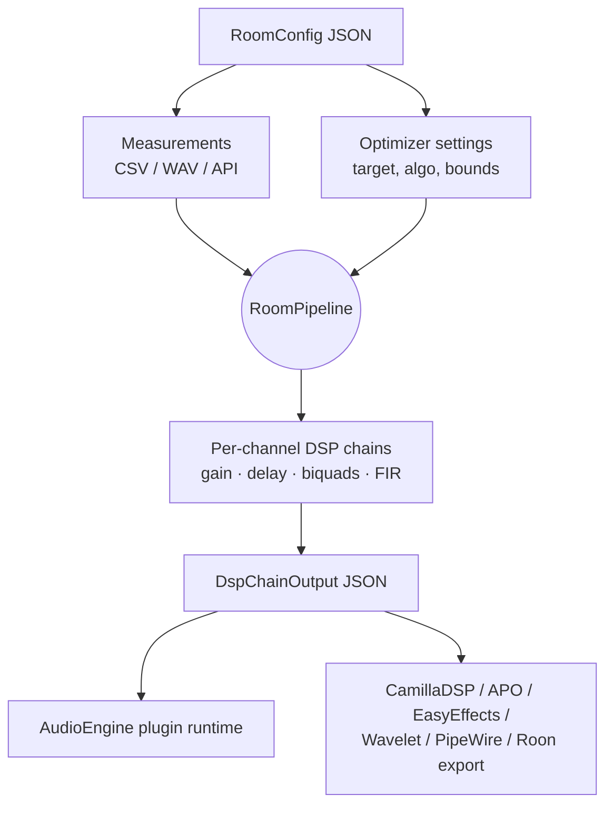

A run is fully described by a single JSON configuration:

* **`speakers`** — a map from a logical name to a measurement source
  (CSV path, WAV recording, in-memory curve, or a `Group` /
  `MultiSubGroup` / `DBA` / `Cardioid` aggregate).
* **`system`** (optional) — explicit topology: `Stereo`, `Stereo 2.1`,
  `HomeCinema`, `Custom`. When present, it selects a specialised workflow
  rather than the generic per-channel path.
* **`crossovers`** — named filter blocks used by multi-driver speakers
  and by bass management (`LR24`, `LR48`, `BW12`, `BW24`).
* **`optimizer`** — target curve, optimizer algorithm, filter count,
  Q / gain / freq bounds, and feature toggles
  (Schroeder split, excursion protection, phase alignment, multi-seat,
  CEA-2034 pre-correction, mixed-phase, …).

The output is a `DspChainOutput`: per-channel `plugins` arrays plus
`global_plugins` (a sparse routing matrix when bass management is active)
and a `metadata` block holding pre/post scores, EPA per channel,
the bass-management report, and version metadata.

---

## 2. The high-level pipeline

`optimize_room()` is the public entry point in
`crates/autoeq/src/roomeq/optimize.rs`. It dispatches into
`RoomPipeline::run()` with an observer that translates internal
`PipelineEvent`s into user-visible `RoomOptimizationProgress` updates.
The pipeline emits the following stages in order:

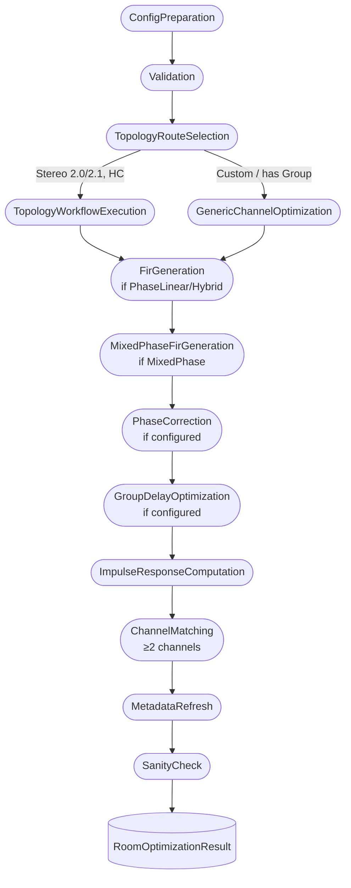

`PipelineStepId` is the canonical list of step names. Observers receive
`Started`/`Completed`/`Failed` events for each step and can `Stop` the
run from any callback (used by the GPUI/TUI front-ends to implement
cancellation).

### 2.1 ConfigPreparation

The incoming `RoomConfig` is cloned. If
`optimizer.cea2034_correction.enabled` is set, the spinorama API is
queried (or the local cache hit) for every speaker, and the resulting
CEA-2034 measurement bundle is stored on `config.cea2034_cache` so the
per-channel workflow can apply a 3-pass speaker pre-correction
(on-axis · listening-window · sound-power) before room correction.

### 2.2 Validation

`validate_room_config(config)` runs a battery of structural checks:

* every `system.speakers` role points to an existing key in `speakers`;
* every named crossover referenced from a speaker is defined;
* every `MeasurementSource::Path` exists on disk and parses as a valid
  curve (frequency grid monotonic, no NaNs);
* phase-data presence is enforced for features that need it
  (multi-seat, phase alignment, mixed-phase);
* min/max frequency bounds lie within the measurement support of every
  channel (this is the common foot-gun: configuring a 20 Hz floor when
  the measurement starts at 50 Hz produces meaningless filters).

Failures abort the run before any optimization happens.

### 2.3 Topology route selection

The dispatcher inspects `config.system`:

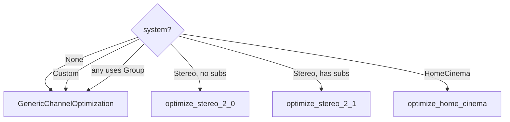

Specialised workflows run group-aware logic (bass management, LFE
routing, multi-sub crossovers); the generic path treats every speaker
in isolation through `process_single_speaker()`.

The dispatcher logs which workflow it selected so users can see at a
glance whether 2.1 / Home-Cinema features were engaged.

---

## 3. Per-channel optimization (`process_single_speaker`)

This is the heart of the system. Whether invoked from a topology
workflow or from the generic path, every channel goes through the same
sequence:

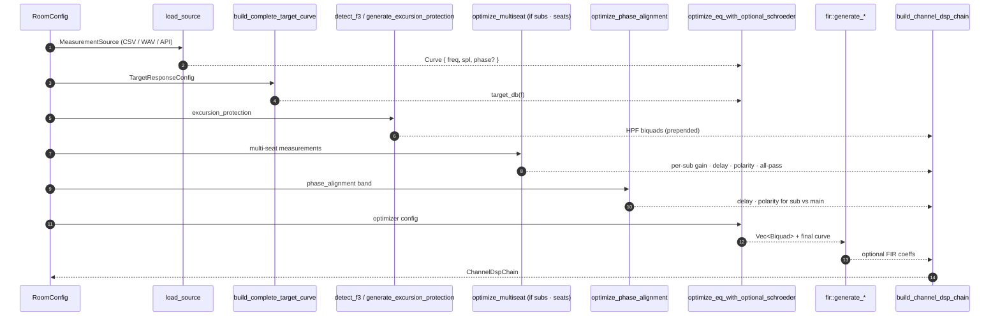

Each box maps directly to a submodule:

| Stage | Module | Key symbol |
|---|---|---|
| Load measurements | `read/` | `load_source(MeasurementSource)` |
| Build target | `roomeq/target_tilt.rs` | `build_complete_target_curve` |
| F3 + HPF | `roomeq/excursion.rs` | `detect_f3`, `generate_excursion_protection` |
| Multi-seat | `roomeq/multiseat.rs` | `optimize_multiseat` |
| Phase alignment | `roomeq/phase_alignment.rs` | `optimize_phase_alignment` |
| EQ search | `roomeq/speaker_eq/schroeder.rs` | `optimize_eq_with_optional_schroeder` |
| FIR | `roomeq/fir.rs` | `post_generate_fir` / `post_generate_mixed_phase_fir` |
| Group delay | `roomeq/gd_opt.rs` | `optimize_group_delay_adaptive` / `build_gd_alignment_target` |
| Build chain | `roomeq/output.rs` | `build_channel_dsp_chain*` |

### 3.1 Loading measurements

`load_source` accepts five kinds of `MeasurementSource`:

* `Path` to a 2-column CSV (`freq, spl`, optional `phase`);
* `WavFile` — runs an FFT-based deconvolution against the matched
  reference signal (MLS or Dirac, configured by `recording_config`)
  to recover the impulse response and convert it into a frequency
  response on a logarithmic grid;
* `InMemory` — a pre-loaded `Curve` (used by the GPUI/TUI when
  measurements are taken interactively);
* `Spinorama` — fetched from `api.spinorama.org`;
* `Aggregate` — average / complex-sum of multiple sub-sources
  (multi-mic, multi-position, …).

After loading, the curve is resampled onto the optimizer's frequency
grid (`config.optimizer.min_freq` … `max_freq`), 1/n-octave smoothed
where requested, and clamped to the measurement support so optimizer
weights never reach into noise.

### 3.2 Building the target curve

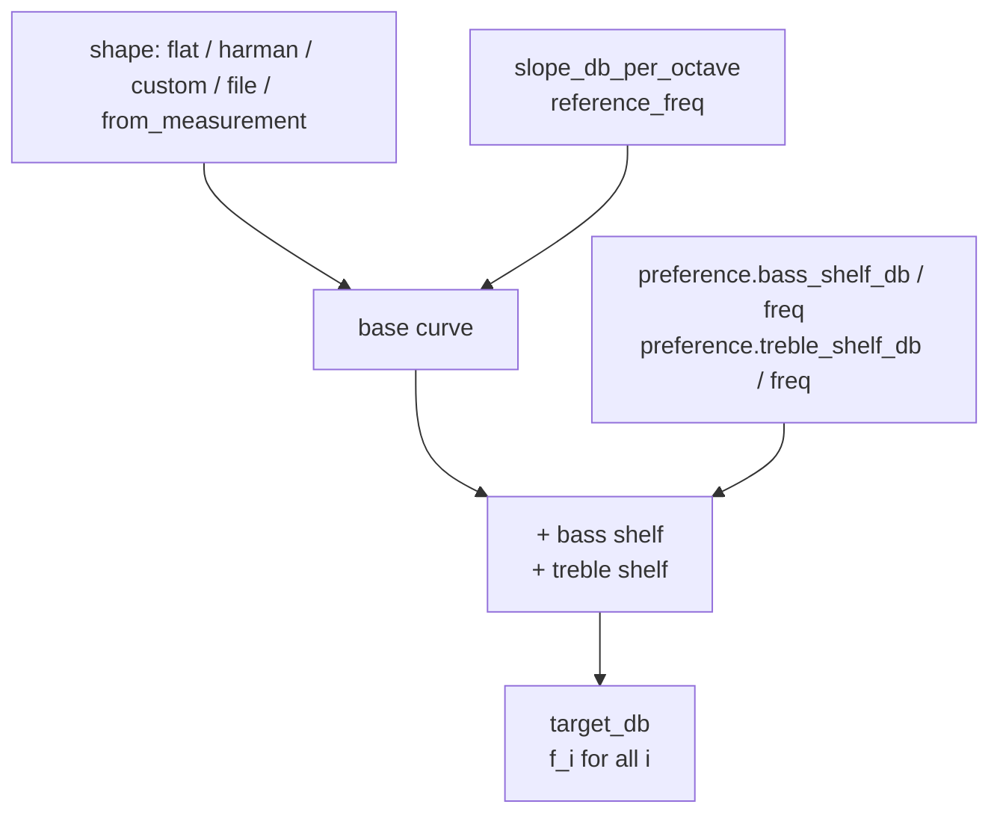

The base shape is one of:

* **`flat`** — `target_db(f) = 0`;
* **`harman`** — Olive / Toole's recommended -0.8 dB/oct in-room slope
  through a configurable reference frequency (default 1 kHz);
* **`custom`** — user-set slope and reference;
* **`file`** — interpolated from a CSV;
* **`from_measurement`** — an optionally smoothed copy of the
  measured curve, useful for "preserve the speaker, fix the room".

User-preference shelves are layered on top with smooth 2nd-order
transitions. When `broadband_precorrection` is enabled, the optimizer
runs a preliminary low-Q broadband fit (broadband shelf + gain) before
the fine-grained PEQ pass, which tames pre-shelf level errors that
otherwise mislead the local optimiser.

### 3.3 Excursion protection (Scenario B)

Bookshelf and small-cabinet drivers cannot produce flat bass below
their cabinet/driver -3 dB point (`F3`). EQ that boosts below `F3`
drives excursion past `Xmax` and produces audible harmonic distortion
or, in the limit, mechanical damage.

```mermaid
flowchart LR
    M[Smoothed measurement<br/>1/3 oct] --> RL[Reference level<br/>100..200 Hz]
    RL --> SD[Search downward<br/>for −3 dB point]
    SD --> F3((F3))
    F3 --> HPF[HPF at F3 · 2^(−margin_octaves)<br/>LR4 / BW2]
```

The detected `F3` is used to place a **highpass filter** that becomes
the first plugin in the channel's chain, before the EQ section.
This bound flows back into the optimiser's frequency range so it
never tries to fight the rolloff with a boost.

### 3.4 Phase alignment (Scenario A — sub + mains)

For systems with subwoofers, time and polarity mismatch around the
crossover region creates a deep cancellation dip that no amount of
gain EQ can fix. Phase alignment optimises **delay** and **polarity**
of the sub relative to the main channel by maximising the energy of
the complex sum in the crossover band:

$$ J(\tau, p) = \int_{f_\text{lo}}^{f_\text{hi}} \left| H_\text{sub}(f) + p \cdot H_\text{main}(f) \cdot e^{-j 2\pi f \tau} \right|^2 \, df $$

where `p ∈ {+1, -1}`. The search is a coarse 0.5 ms grid over
`[-max_delay, +max_delay]`, refined to 0.1 ms around the best point.
Phase-aware: requires phase data on both measurements (REW exports
phase, the WAV-based loader recovers it from the IR).

### 3.5 Multi-seat / SFM optimization

In rooms with multiple listening positions the modal field varies
significantly. Optimising for a single seat usually degrades others.
RoomEQ exposes two families of multi-sub optimisation:

* **MSO-style magnitude objectives** that fit the summed SPL across
  seats.
* **SFM-style modal-basis optimisation** that works in the complex
  domain and suppresses dominant non-common seat-pressure modes.

Both families use the same control surface: per-sub gain, delay,
polarity, and optional all-pass filters.

On the production `MultiSubGroup` path this is activated by setting
`optimizer.multi_seat.enabled = true` and making every subwoofer entry a
multi-measurement source. The `measurements` arrays are interpreted as
seat order, so sub 1 seat 0, sub 2 seat 0, etc. must describe the same
listening position. All subs must have the same seat count and every
sub/seat curve must include phase.

The production order is:

1. Load the per-sub/per-seat measurement matrix.
2. Optionally optimise a PEQ for each individual sub across its seat
   measurements (`multi_seat.per_sub_peq`, default `true`).
3. Run MSO/SFM over the corrected matrix for per-sub gain, delay,
   polarity, and configured all-pass filters.
4. Rebuild the combined response at every seat and optionally optimise
   a shared EQ across those combined seat responses
   (`multi_seat.global_eq`, default `true`).
5. Export per-sub driver chains carrying the per-sub PEQ, gain/polarity,
   delay, and all-pass filters, plus the shared channel EQ.

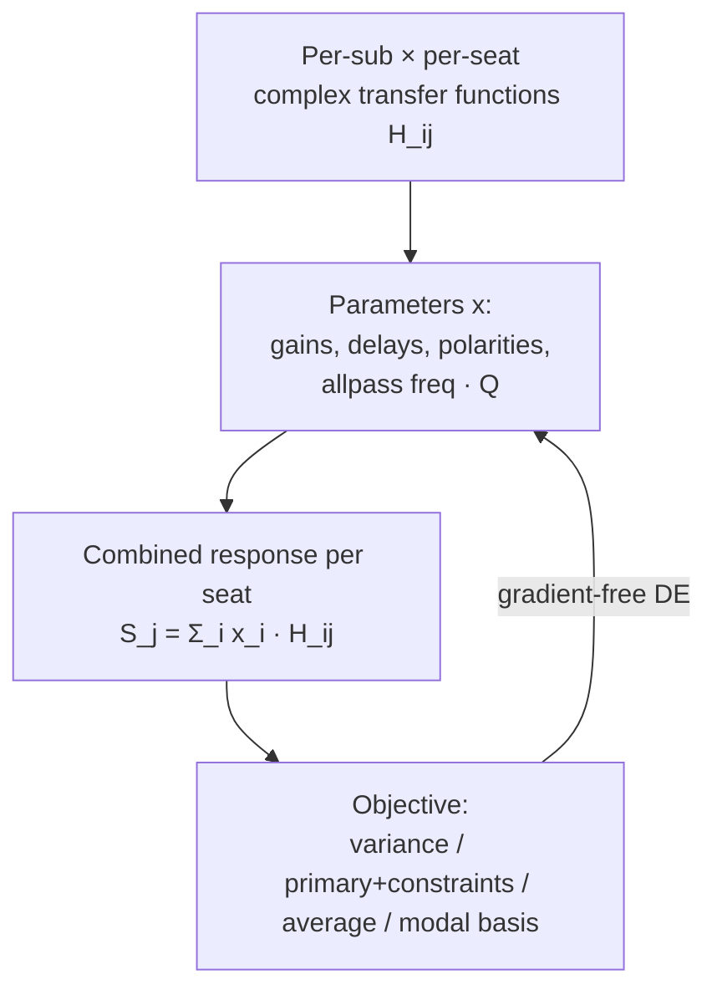

Four strategies are exposed through `multi_seat.strategy`:

* **`minimize_variance`** — minimise the standard deviation of SPL
  across seats in the optimisation band.
* **`primary_with_constraints`** — optimise the primary seat while
  constraining secondary seats within `max_deviation_db`.
* **`average`** — flatten the cross-seat magnitude average.
* **`modal_basis`** — extract a complex modal basis from the
  per-sub/per-seat transfer functions, then minimise the candidate
  summed response projected onto those dominant non-common modes.

For `modal_basis`, each sub/frequency snapshot is the complex seat
vector

$$ h_i(f) = [H_{i1}(f), \ldots, H_{iM}(f)]^T $$

RoomEQ removes the common seat component,

$$ a_i(f) = h_i(f) - \operatorname{mean}_\text{seat}(h_i(f)) \cdot \mathbf{1} $$

normalises the non-zero snapshots, stacks them into a matrix, and runs
SVD:

$$ A = U \Sigma V^H $$

The retained columns of `U` are the dominant seat modes. The mode count
is capped at `min(seats - 1, subs, 8)` and normally stops once 95% of
the singular-value energy is retained. A candidate combined response
`s(f)` is then centred across seats and penalised by its projection
onto those modes:

$$ J_\text{modal}(f) = \sum_k \left| u_k^H \left(s(f) - \operatorname{mean}_\text{seat}(s(f)) \cdot \mathbf{1}\right) \right|^2 $$

This makes the optimiser target coupled modal seat-to-seat variation
instead of only matching magnitudes after the complex summation has
already happened. Because the basis is complex, `modal_basis` requires
phase for every sub/seat measurement. If no non-common complex modes
can be extracted, the configuration is rejected rather than silently
falling back to a scalar magnitude objective.

Minimal config:

```json
{
  "optimizer": {
    "multi_seat": {
      "enabled": true,
      "strategy": "modal_basis"
    }
  }
}
```

Production multi-sub input shape:

```json
{
  "speakers": {
    "lfe": {
      "name": "subs",
      "subwoofers": [
        {
          "measurements": [
            "sub1_seat0.csv",
            "sub1_seat1.csv"
          ]
        },
        {
          "measurements": [
            "sub2_seat0.csv",
            "sub2_seat1.csv"
          ]
        }
      ]
    }
  },
  "optimizer": {
    "multi_seat": {
      "enabled": true,
      "strategy": "modal_basis",
      "optimize_polarity": true,
      "allpass_filters_per_sub": 1,
      "per_sub_peq": true,
      "global_eq": true
    }
  }
}
```

Useful options:

* `optimize_polarity` — include per-sub polarity inversion in the
  continuous search. Default: `false`.
* `allpass_filters_per_sub` — add this many all-pass biquads per
  optimised sub. Frequencies are searched inside the optimisation band,
  clamped to 20-200 Hz, with Q from 0.3 to 5.0. Default: `0`.
* `primary_seat` and `max_deviation_db` — only affect
  `primary_with_constraints`.
* `per_sub_peq` — fit each sub's PEQ against that sub's measurements
  across all seats before MSO. Default: `true`.
* `global_eq` — fit the final shared EQ against the post-MSO combined
  response across all seats. Default: `true`.
* `seat_weights` and `primary_seat_weight` — weight seats for the
  derived multi-measurement PEQ passes; primary weighting is applied
  when `strategy = "primary_with_constraints"`.

The first sub is the timing/gain reference. Remaining subs are searched
over gain `[-6, +6] dB`, delay `[0, 20] ms`, optional polarity, and any
configured all-pass filters.

Shared guardrails prevent pathological solutions:

* `MSO_MAX_MEAN_OUTPUT_LOSS_DB = 1.5` — gives up bass headroom only
  up to 1.5 dB on average.
* `MSO_NULL_DEFICIT_ALLOWANCE_DB = 3.0` — does not chase deeper nulls
  by 3 dB more than necessary.
* headroom-boost and low-frequency-extension penalties keep the search
  from trading modal suppression for excessive bass boost or lost
  extension.

### 3.6 Time alignment (`time_align.rs`)

When measurements come from synchronised WAV recordings of an MLS or
Dirac probe, the time of arrival of each channel can be measured
directly. `find_arrival_time(wav)` performs threshold detection
relative to peak, and `detect_delay_with_probe()` cross-correlates the
recovered IR with the reference signal envelope. The shortest arrival
becomes the reference, and per-channel **delay plugins** equalise the
others to within one sample.

When per-channel probe-arrival overrides are passed in (the GPUI
"Detect delay" UI step), `optimize_room_with_probe_arrivals()` skips
WAV-onset detection and uses the measured ms values directly.

### 3.7 EQ optimization with Schroeder split

The Schroeder frequency `f_S` is the boundary between **modal** room
behaviour (sparse, isolated resonances — narrow, high-Q corrections
work) and **statistical** behaviour (overlapping modes — broad
corrections work):

$$ f_S \approx 2000 \sqrt{\frac{T_{60}}{V}} $$

(or the simplified `11885 / √V` from room volume alone).

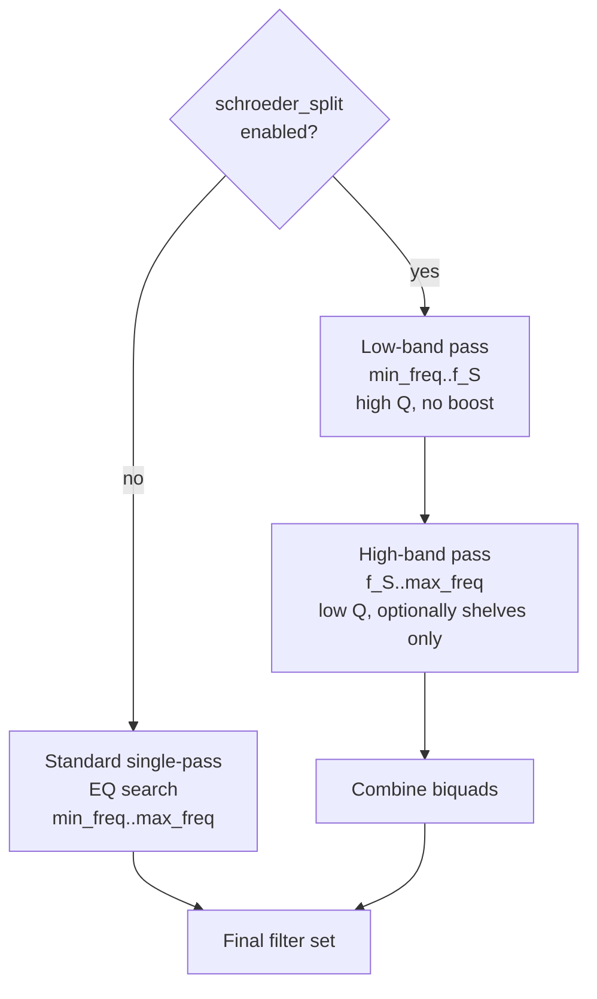

Each pass runs `autoeq::optim::optimize_filters` over the configured
algorithm:

* **DE** (Differential Evolution) — global search seeded with a Sobol
  quasi-random population. Robust to multi-modal loss landscapes,
  parameter strategies (`currenttobest1bin`, `rand1bin`, …).
* **NLOPT COBYLA** — local trust-region constrained search; very fast
  when the initial guess is good.
* **NLOPT ISRES** — global stochastic ranking ES.
* **MetaHeuristics PSO** etc.

The **loss function** is selected by `loss_type`:

* **`flat`** — ERB-weighted MSE between the corrected curve and the
  target.
* **`score`** — Olive / Toole speaker-preference score
  (NBD + LFX + SM·PIR with bass-boost shaping).
* **`epa`** — Zwicker/Fastl psychoacoustic composite of flatness +
  sharpness + roughness + loudness-balance + cubic-distortion-tone
  level + modal temporal masking. Tunable via
  `OptimizerConfig.epa_config`. Pre/post EPA scores are always emitted
  in the JSON metadata.

When EPA is selected, RoomEQ also passes detected modal peaks into the
optimizer as temporal-masking data. Each mode carries frequency, Q,
prominence, and a perceptual temporal-severity value from
`temporal_targets.rs`. The EPA loss estimates how much audible ringing
remains after the candidate PEQ curve: cuts at severe modal peaks reduce
the penalty, while boosts at those modes increase it. The
`epa_config.temporal_masking.profile` setting changes the material
assumption: `transient` penalizes ringing most strongly, `mixed` is the
default, and `sustained` assumes more post-masking from ongoing tonal
content.

For FIR-bearing modes, the same temporal-masking configuration also drives a
true impulse-response analysis after FIR generation. RoomEQ finds the FIR's
main impulse peak, treats it as a transient masker, and separately measures
pre-ringing and post-ringing energy after applying configurable pre- and
post-masking windows. Those metrics are reported per channel as
`fir_temporal_masking` and summarized in `metadata.perceptual_metrics`.

### 3.8 FIR / mixed-phase post-generation

When `processing_mode` is `PhaseLinear` or `Hybrid`, the IIR result
is converted to a phase-linear FIR by inverse-FFT of the magnitude
response (windowed, length = `fir_taps`). The chain then gets a
`convolution` plugin that loads `<channel>_fir.wav`.
The generated coefficients are then analyzed directly for audible pre-ringing
before the main tap and post-ringing after it, using
`epa_config.temporal_masking.pre_mask_ms` and `post_mask_ms`.

`MixedPhase` instead decomposes the impulse response into
**minimum-phase** and **excess-phase** parts (cepstral folding) and
generates a short excess-phase corrector FIR. This compensates the
group-delay character of the room without the latency cost of full
phase linearisation.

`PhaseCorrection` adds a standalone rePhase-style allpass-only
correction on top.

When `optimizer.group_delay.enabled = true`, GD-Opt runs after the
phase/FIR stages and before impulse-response reporting. In
`LowLatency`, `Hybrid`, and `MixedPhase` modes it exports delay,
polarity, and all-pass plugins where the configured mode allows them.
If `adaptive_allpass` is enabled, all-pass filters are accepted only
when every participating channel supplies matching independent
multi-measurement sweeps with phase and coherence; otherwise RoomEQ
downgrades to delay-only and records the
`allpass_disabled_no_bootstrap_realisations` advisory.

`PhaseLinear` does not emit IIR all-pass or delay plugins for GD-Opt.
Instead RoomEQ builds a `GdAlignmentTarget` and encodes the optimized
per-channel delay as a sample shift in the FIR coefficients before
rewriting the convolution WAV. This keeps the exported chain FIR-native
while still reflecting group-delay alignment in the reported phase and
IR waveforms.

### 3.9 Channel matching (≥ 2 channels)

After every channel is independently optimised, the optimiser still
needs to make the channels match each other. Three corrections run:

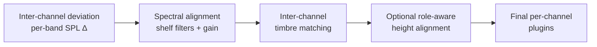

* **`compute_inter_channel_deviation`** — a band-by-band SPL
  difference report (the GPUI front-end shows this as a heatmap).
* **`compute_spectral_alignment`** — fits low/high shelves + gain to
  bring each channel's broadband balance toward the cross-channel
  average.
* **`compute_inter_channel_timbre_matching`** — applies broadband shelf/gain
  matching only when the normalized timbre-spread metric improves by the
  configured threshold.
* **`compute_height_channel_alignment`** — optionally aligns overhead timbre,
  level, and arrival time against role-appropriate bed-channel references.

### 3.10 Sanity check & IR computation

Pre/post impulse responses are computed for visualisation. The final
`RoomOptimizationResult` is run through `sanity_check_result()`:

* every channel's `freq`/`spl` lengths match;
* no NaN / non-finite SPL values (which would signal optimiser
  divergence).

Debug builds `debug_assert!` so test runs surface the exact violated
invariant; release builds return a clean `Err` so fuzz/QA jobs report
divergence rather than ship a corrupted DSP chain.

---

## 4. Topology workflows

### 4.1 Stereo 2.0 / 2.1

`optimize_stereo_2_0` and `optimize_stereo_2_1` reuse
`process_single_speaker` for L and R, but layer:

* **2.1**: the `LFE` / sub channel gets its own optimisation against
  the bass-management crossover (LR24 by default).
* **Phase alignment**: between each main and the sub at the crossover
  frequency.
* **Bass management routing**: sub gain is linked across mains so
  bass content sums coherently rather than per-channel-independent.

### 4.2 Home Cinema

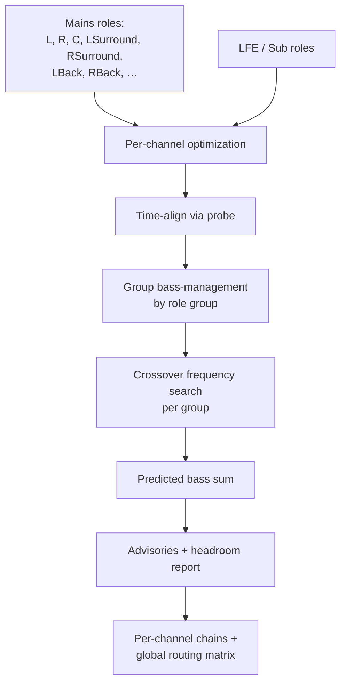

Highlights:

* Roles are grouped (front, surround, surround-back, height) so a
  single crossover decision covers each group rather than fighting
  across symmetric channels.
* `optimize_home_cinema_group_crossovers` searches the crossover
  frequency for each group jointly with the sub gain, evaluating the
  predicted bass sum against the target curve.
* A **bass-bus headroom simulation** estimates how much summed bass
  energy hits the LFE bus at typical levels, surfacing clipping risk
  as advisories rather than silent saturation.
* The result includes a `BassManagementRoutingGraph` that the
  AudioEngine renders as a sparse matrix plugin sitting before any
  per-channel plugins.

### 4.3 Specialised aggregates

* **`MultiSubGroup`** — multiple subs treated as a single virtual
  channel. With one measurement per sub, the group uses the legacy
  gain/delay or all-pass-enhanced multisub optimiser. With
  `optimizer.multi_seat.enabled = true` and per-sub multi-measurement
  sources, it uses the production multi-seat path described above:
  per-sub PEQ, MSO/SFM gain-delay-polarity-all-pass, then shared
  multi-seat EQ on the combined response.
* **`DBA` (Double Bass Array)** — front-wall sources + delayed
  back-wall sources to cancel the modal field below a target
  frequency.
* **`Cardioid`** — phase-and-delay-aligned pair of drivers producing a
  cardioid bass radiation pattern for sidewall cancellation.

Each aggregate has its own `build_*_dsp_chain` in `roomeq/output.rs`.

### 4.4 Supporting-source room compensation

A supporting-source loudspeaker (Brooks-Park et al., JASA 159(4), 2026)
is a delayed, decorrelated source that fills reverberant energy around a
primary loudspeaker without altering the primary's direct sound. In
RoomEQ this is exposed as a `SpeakerConfig::SupportingSource` group
containing `primary` and `support` measurement sources plus a
`SupportingSourceConfig`.

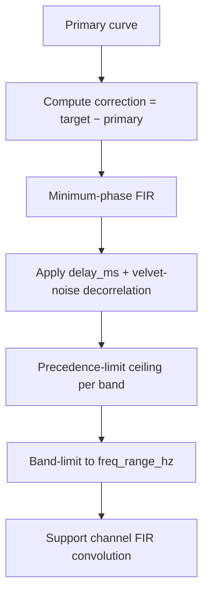

The processing path, implemented in `roomeq/supporting_source/filter.rs`,
works as follows:

1. **Target construction** — use the room-level target curve (or an
   optional per-group override).
2. **Correction curve** — compute `target − primary` and convert it to a
   minimum-phase response via cepstral folding.
3. **Precedence limit** — for each configured band, clip the support
   gain so the lagging source does not exceed the primary by more than
   `limit_db`. This preserves the primary source's localization.
4. **Band limiting** — mute the support FIR outside `freq_range_hz`.
5. **Decorrelation** — optionally convolve the support FIR with a velvet-
   noise sequence (`roomeq/supporting_source/velvet.rs`) to reduce
   correlation with the primary while keeping the spectral envelope.
6. **DRR diagnostics** — `roomeq/supporting_source/drr.rs` reports a
   statistical DRR summary before and after compensation in
   `metadata.supporting_source`.

Both the stereo 2.0 workflow (`roomeq/workflows/stereo.rs`) and the home-cinema
workflow (`roomeq/workflows/home_cinema.rs`) detect `SupportingSourceGroup`
entries. Supporting-source roles are partitioned from single-source mains; after
the mains are optimized (and, in home cinema, after bass management and post-EQ),
the supporting-source processor runs for each logical role and emits two output
channels: the primary channel (e.g. `L` / `WideLeft`) and the supporting channel
(`L_support` / `WideLeft_support` by default, configurable via
`system.supporting_source_outputs.suffix`).

Spatial robustness is reported per supporting-source role: a single-position
measurement produces a `single_position_measurement` advisory, while multiple
positions with >3 dB or >6 dB of mean within-band variance produce
`moderate_spatial_variance` or `high_spatial_variance` advisories. These are
returned in `metadata.supporting_source.{role}.advisories`.

Minimal config:

```json
{
  "system": {
    "model": "stereo",
    "speakers": { "L": "left_pair", "R": "right_pair" }
  },
  "speakers": {
    "left_pair": {
      "name": "Left Main + Support",
      "primary": "measurements/left_primary.csv",
      "support": "measurements/left_support.csv"
    }
  }
}
```

---

## 5. Optional advanced corrections

These run after per-channel EQ when configured:

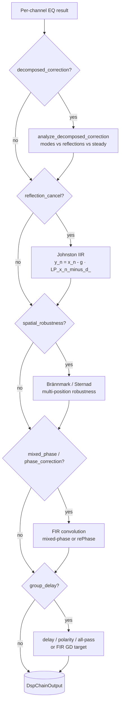

* **Decomposed correction** (Laborie/Bruno/Montoya, 2003) splits the
  IR into modal, early-reflection, and steady-state regions and
  applies different correction strategies to each.
* **EPA temporal masking** reuses the detected modal peaks from
  decomposed correction as optimizer-side perceptual data. This keeps
  the loss cheap enough for every candidate evaluation while still
  steering filters differently for transient-heavy versus sustained
  programme material.
* **First-reflection cancellation** (Johnston, AES 2008) subtracts a
  delayed low-passed copy of the input below ~500 Hz to cancel the
  measured first floor/ceiling reflection.
* **Spatial robustness** (Brännmark & Sternad, AES 2008 + EP2104374B1)
  trades single-point flatness for cross-position robustness with a
  spatial zero-clustering pre-ringing constraint.
* **Mixed-phase / phase correction** post-generates a short FIR that
  corrects excess phase without doubling latency.
* **Group-delay optimisation** aligns the summed phase/GD response
  across channels. IIR-capable modes can emit delay, polarity, and
  all-pass plugins; `PhaseLinear` folds the delay target into the FIR
  coefficients instead.

---

## 6. Output and export

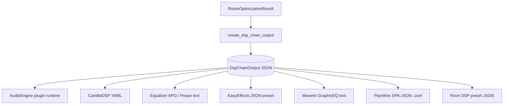

`DspChainOutput` carries:

* `channels` — per-channel `plugins` arrays
  (`gain` → `delay` → `eq` (biquads) → `convolution` (FIR) → …),
* `global_plugins` — a sparse matrix `crossover` plugin for bass
  management when the topology requires routing,
* `metadata` — pre/post combined scores, EPA per channel, optimizer
  algorithm, iteration counts, version stamp, and a full
  `BassManagementReport` (routing graph, group crossovers, headroom
  simulation, advisories).

Final metadata also includes `correction_acceptance` when the audibility safety
gate can evaluate aligned pre/post/target curves. The gate records whether the
chain was accepted, a corrective stage was reverted, or identity correction was
used. Mixed chains are re-synthesized at the run's sample rate and independently
test PEQ, MSO, group-delay/all-pass, and FIR removal. A revert retains crossover,
routing, delay, gain, and polarity infrastructure required by the topology.

Measurement confidence is classified from coherence, signal-to-noise margin,
and multi-seat variance. Degraded measurements reduce correction depth; poor
measurements are capped at 35%, and unusable or mismatched measurement grids are
rejected explicitly.

The acoustic-quality scorecard extends this contract across training and
held-out positions. It reports target-weighted median RMS, p95 and worst
residuals, normalized seat spread, separate below/above-Schroeder results,
correction energy, peak boost/cut, induced group-delay RMS, below-Schroeder
modal curvature, pre-ringing, latency, and available headroom. Different
measurement grids are evaluated only over their explicit shared frequency
overlap; sparse grids and missing phase degrade individual metrics rather than
silently changing the evaluation range.

Callers with measurements excluded from optimization can attach them through
RoomPipeline::with_validation_measurements. The runtime correction metadata
then carries the same held-out scorecard used by corpus QA.

`data_tests/roomeq/acoustic_corpus/manifest.json` is the versioned corpus entry
point. It includes repository-owned real stereo measurements and FEM rooms with
training/held-out seats, stereo-with-sub, MSO/multi-sub, and 5.1 home-cinema
paths. Provenance and intake rules live beside the manifest in PROVENANCE.md.
The PR recipe runs the bounded tier; the nightly recipe includes the full
corpus. Calibrated manifest gates enforce the 0.1 dB held-out improvement and
0.25 dB p95-regression limits.
The compact `baseline.json` snapshot records current-main metrics for each
scenario; every corpus run emits paired weighted-RMS, p95, improvement,
headroom, group-delay, and modal-roughness deltas. The report recipe writes JSON
and Markdown, appends runtime/memory trend history, and enforces the PR resource
budget. The recalibration recipe intentionally replaces snapshots after a
reviewed quality change. Four fixed noise/coherence seeds exercise robustness
deterministically.

The matched candidate runner compares the same measurements, seeds, bands, and
held-out positions before recommending a change. The headroom-smooth objective
is promoted only for the 2.2 MSO scenario, where it reduced peak boost by more
than 1 dB while keeping weighted-RMS and p95 tradeoffs inside the promotion
policy; other topologies retain the current-main objective.
The nightly measured-T7V case also runs an equal-budget DE backend against the
current CMA-ES path so backend changes have a matched, non-promotional control.

`export_dsp_chain` (`roomeq/export.rs`) serialises the result into
external formats. Some targets (e.g. EasyEffects, Wavelet GraphicEQ)
do not support routing matrices or convolution; the exporter rejects
those configurations explicitly rather than silently dropping plugins.

Every external exporter is fail-closed: a successful render has accounted for
every plugin, global operation, and driver branch. CamillaDSP preserves the
widest contract, including supported bass-management routing. Equalizer APO
supports serial gain/delay/EQ/convolution and a checked static `Channel`/`Copy`
routing subset. Roon rejects all-pass filters, multiple per-channel convolution
IRs, and more than its 20-filter limit instead of substituting or truncating.
EasyEffects and Wavelet accept only gain/EQ chains that are identical on every
channel, because their exported presets are system-wide rather than independent
per-channel graphs.

Equalizer APO also has a native Windows engine test. The
`qa-export-equalizer-apo` recipe runs the official `Benchmark.exe`, which loads
Equalizer APO's real `FilterEngine`, processes a deterministic WAV through the
generated configuration, and compares the measured result with RoomEQ's
expected response. Set `ROOMEQ_EQUALIZER_APO_BENCHMARK` when Equalizer APO is
installed outside its standard location; the test needs permission to
temporarily update Equalizer APO's `ConfigPath` registry value and restores it
afterward.

The PipeWire exporter preserves the per-channel plugin order and has native
coverage for signed gain/polarity, delay, all RoomEQ biquad variants, LR24 and
LR48 crossover cascades, and WAV convolution. Its Linux QA loads configurations
covering those nodes into a real PipeWire daemon and verifies that both filter
endpoints were instantiated. Graph-level matrix routing, XTC, active-driver
fan-out, and mixed-mode `band_split`/`band_merge` are not serial operations;
PipeWire export rejects them explicitly and directs users to the CamillaDSP or
native SotF graph export until equivalent PipeWire graph rendering is added.

---

## 7. Code map

```text
crates/autoeq/src/roomeq/
├── mod.rs                    # public re-exports and module wiring
├── pipeline.rs               # RoomPipeline / Event / Observer
├── optimize.rs               # optimize_room, optimize_speaker, RoomOptimizationResult
├── workflows.rs              # topology dispatch (stereo, home cinema, custom)
│   └── bass_management.rs    # group crossover optimisation
├── speaker_eq.rs             # process_single_speaker, multi-meas strategies
│   └── schroeder.rs          # optimize_eq_with_optional_schroeder
├── group_processing.rs       # multi-driver crossover, multisub, DBA, cardioid, mixed-mode
├── eq.rs                     # core EQ search adapter (autoeq::optim wrapper)
├── crossover.rs              # crossover filter design (LR / BW)
├── time_align.rs             # WAV onset + probe-burst delay detection
├── multiseat.rs              # MSO objectives + modal-basis SFM optimisation
├── phase_alignment.rs        # sub/main delay+polarity grid+refine
├── target_tilt.rs            # build_complete_target_curve
├── excursion.rs              # F3 detection + protection HPF
├── multisub.rs               # multi-sub flat optimisation
├── dba.rs                    # double bass array
├── cea2034_correction.rs     # 3-pass speaker pre-correction
├── mixed_phase.rs            # IIR + excess-phase FIR
├── impulse_analysis.rs       # decomposed correction (modes/refl/steady)
├── reflection_cancel.rs      # Johnston first-reflection canceller
├── spatial_robustness.rs     # Brännmark / Sternad multi-position
├── spectral_align.rs         # inter-channel shelf+gain alignment
├── voice_of_god.rs           # narrow-band timbre matching across channels
├── fir.rs                    # FIR generation from biquad set
├── ir_waveform.rs            # pre/post IR computation
├── output.rs                 # DSP-chain construction and serialisation
├── export.rs                 # CamillaDSP / APO / EasyEffects / … exporters
├── home_cinema.rs            # bass management report, headroom, signal-flow advisories
├── supporting_source/        # Brooks-Park supporting-source room compensation
│   ├── filter.rs             # support FIR design and precedence limits
│   ├── velvet.rs             # velvet-noise decorrelation
│   └── drr.rs                # direct-to-reverberant ratio diagnostics
├── bass_phase_confidence.rs  # bass-phase coherence gate for GD-Opt v2
├── gd_opt.rs                 # group-delay optimisation v2 (LowLatency IIR)
├── frequency_grid.rs         # grid validation, common-range computation
├── slope.rs                  # broadband slope estimation
├── temporal_targets.rs       # perceptual decay / temporal-masking thresholds
├── synthetic.rs              # synthetic measurements for QA
├── progress.rs               # multi-stage progress reporter
└── types/                    # config / output data structures
```

---

## 8. Where to look next

* [`README.md`](../README.md) — CLI overview, capabilities, and documentation
  index.
* [`ROOMEQ_INPUT_FORMAT.md`](ROOMEQ_INPUT_FORMAT.md) — full input guide with
  every major configuration family documented.
* [`ROOMEQ_OUTPUT_FORMAT.md`](ROOMEQ_OUTPUT_FORMAT.md) — full output guide for
  `DspChainOutput` consumers.
* [`INPUT_FORMAT.md`](../src/bin/roomeq/INPUT_FORMAT.md) — focused examples for
  newly added configuration blocks.
* [`REFERENCES.md`](REFERENCES.md) — references for every cited algorithm.
* `crates/math-audio/math-iir-fir/REFERENCES.md` — RBJ cookbook,
  Linkwitz-Riley, Orfanidis, Vicanek, Zavalishin TPT/SVF, Kirkeby,
  filtfilt.
* `crates/math-audio/math-optimisation/REFERENCES.md` — DE, JADE,
  L-SHADE, COBYLA, ISRES, Levenberg-Marquardt.

---

## References

This section consolidates the citations directly relevant to the
RoomEQ pipeline. The full bibliography lives in
[`REFERENCES.md`](../REFERENCES.md).

### CEA / CTA-2034 spinorama standard

Consumer Technology Association. *ANSI/CTA-2034-A — Standard Method of
Measurement for In-Home Loudspeakers.* 2015. (Originally CEA-2034.)
Used by `cea2034.rs` to derive the listening-window / sound-power /
PIR curves and the NBD / LFX / SM-PIR sub-metrics that feed the
preference score.

### Olive speaker preference score

Olive, Sean E. *A Multiple Regression Model for Predicting Loudspeaker
Preference Using Objective Measurements: Parts I & II.* AES Conv. 116
& 117, 2004.
<https://www.aes.org/e-lib/browse.cfm?elib=12794>

Toole, Floyd E. *Sound Reproduction: The Acoustics and Psychoacoustics
of Loudspeakers and Rooms.* 3rd ed., Routledge, 2017. ISBN 978-1138921368.

### Harman in-room target / -0.8 dB/oct slope

Olive, Welti, McMullin. *The Influence of Listeners' Experience, Age,
and Culture on Headphone Sound Quality Preferences.* AES Conv. 137,
2014.

Toole, Floyd E. *The Measurement and Calibration of Sound Reproducing
Systems.* J. Audio Eng. Soc., 63(7/8):512–541, 2015.
DOI 10.17743/jaes.2015.0064.

### Schroeder frequency

Schroeder, Manfred R. *Frequency-correlation functions of frequency
responses in rooms.* JASA 34(12):1819–1823, 1962.
DOI 10.1121/1.1909136.

Schroeder, Manfred R. *The "Schroeder Frequency" Revisited.* JASA
99(5):3240–3241, 1996. DOI 10.1121/1.414868.

Used by `roomeq/eq.rs::estimate_schroeder_frequency` to split modal
from statistical room behaviour.

### Phase-coherent EQ

Klein, Werner, Brandenburg. *Phase-Coherent Equalization of
Loudspeakers.* AES Conv. 142, 2017.

Zacharov, Bech, Meares. *The Use of Trained Listeners in Multichannel
Sound Evaluation: Effect of Phase on Loudspeaker Sound Quality.* AES
Conv. 105, 1998.

### Brännmark & Sternad — robust room correction

Brännmark, Ahlén. *Spatially Robust Audio Compensation Based on SIMO
Feedforward Equalization.* AES Conv. 124, 2008.
<https://www.aes.org/e-lib/browse.cfm?elib=14529>

Brännmark, Sternad. *Method and apparatus for designing low-pre-ringing
inverse filters.* European Patent EP2104374B1, 2009.

Used by `roomeq/spatial_robustness.rs` and the pre-ringing constraint
in `roomeq/mixed_phase.rs`.

### Decomposed room correction

Laborie, Bruno, Montoya. *A New Comprehensive Approach of Surround
Sound Recording.* AES Conv. 114, 2003.
<https://www.aes.org/e-lib/browse.cfm?elib=12565>

Used by `roomeq/impulse_analysis.rs` to split the IR into modal,
early-reflection, and steady-state regions for differentiated
correction.

### Johnston — first-reflection cancellation

Johnston, James D. *Loudspeaker / Room Equalization in the Time and
Frequency Domains.* AES Conv. 125, 2008.

Used by `roomeq/reflection_cancel.rs::cancel_first_reflection`.

### ERB / cochlear bandwidth

Glasberg, Moore. *Derivation of auditory filter shapes from
notched-noise data.* Hearing Research 47(1-2):103–138, 1990.
DOI 10.1016/0378-5955(90)90170-T.

`24.7 · (1 + 4.37 · f/1000)` is used by `loss/enhanced_weights.rs` for
ERB-weighted flatness loss.

### Zwicker / Fastl psychoacoustics (EPA)

Zwicker, Fastl. *Psychoacoustics: Facts and Models.* 3rd ed., Springer,
2007. ISBN 978-3540231592. DOI 10.1007/978-3-540-68888-4.

Zwicker. *Ein Verfahren zur Berechnung der Lautstärke.* Acustica 10:
304–308, 1960.

### ISO 226 equal-loudness contours

International Organization for Standardization. *ISO 226:2003 —
Acoustics — Normal equal-loudness-level contours.* 2003.

### DIN 45692 — sharpness

Deutsches Institut für Normung. *DIN 45692:2009-08 — Measurement
technique for the simulation of the auditory sensation of sharpness.*
2009.

Aures, Wolfgang. *Berechnungsverfahren für den sensorischen Wohlklang
beliebiger Schallsignale.* Acustica 59:130–141, 1985.

### Sobol quasi-random sequences

Sobol', Ilya M. *On the distribution of points in a cube and the
approximate evaluation of integrals.* USSR Comp. Math. & Math. Phys.
7(4):86–112, 1967. DOI 10.1016/0041-5553(67)90144-9.

Joe, Kuo. *Constructing Sobol sequences with better two-dimensional
projections.* SIAM J. Sci. Comput. 30(5):2635–2654, 2008.
DOI 10.1137/070709359.

Used by `optim/de.rs::init_sobol` to seed the Differential Evolution
population.

### Multi-objective genetic algorithms

Deb, Pratap, Agarwal, Meyarivan. *A fast and elitist multiobjective
genetic algorithm: NSGA-II.* IEEE TEVC 6(2):182–197, 2002.
DOI 10.1109/4235.996017.

Ramos, López. *Multiobjective Genetic Algorithm Optimization of
Linkwitz-Riley Crossovers Using Group Delay and Magnitude Response
Criteria.* AES Conv. 121, 2006.

### Multi-subwoofer sound-field management

Welti, Todd; Devantier, Allan. *Low-Frequency Optimization Using
Multiple Subwoofers.* JAES 54(5):347-365, 2006.

Used by `roomeq/multiseat.rs` as the practical MSO baseline. The
`modal_basis` strategy extends the same multi-sub control problem with
SVD/PCA over complex per-sub/per-seat transfer functions so the
optimiser can suppress dominant seat modes directly.

### Optimization algorithms

See [`crates/math-audio/math-optimisation/REFERENCES.md`](../../math-audio/math-optimisation/REFERENCES.md)
for COBYLA (Powell, 1994), ISRES (Runarsson & Yao, 2005),
Differential Evolution (Storn & Price, 1997 — and JADE / L-SHADE
variants), and Levenberg-Marquardt.

### Filter design

See [`crates/math-audio/math-iir-fir/REFERENCES.md`](../../math-audio/math-iir-fir/REFERENCES.md)
for the RBJ cookbook (Bristow-Johnson), Linkwitz-Riley crossovers,
Butterworth filters, Orfanidis high-shelf design, Vicanek matched
biquads, Zavalishin TPT/SVF state-variable filters, the Kirkeby
inverse-filter regularisation, and `filtfilt` zero-phase filtering.
